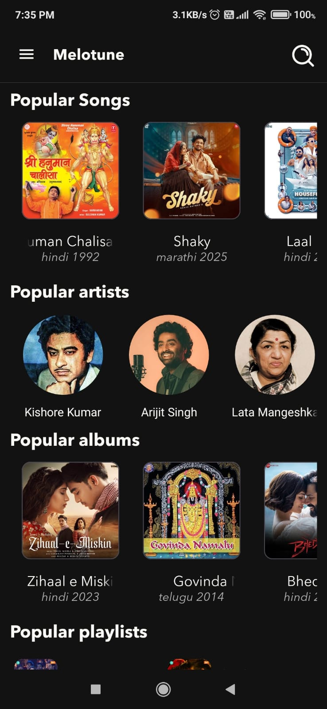
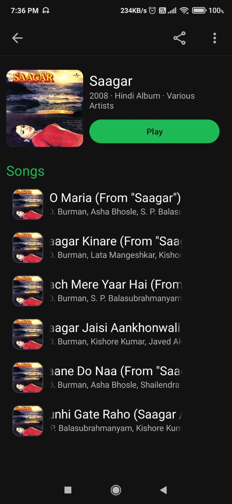
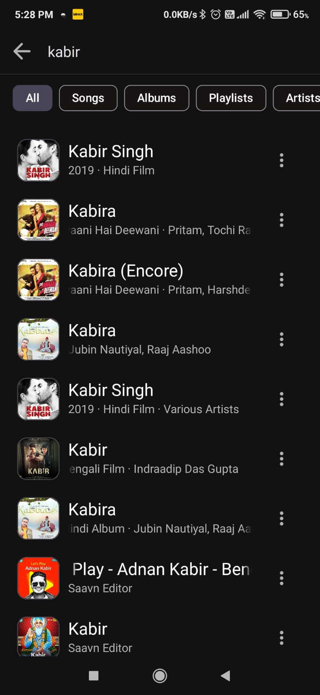
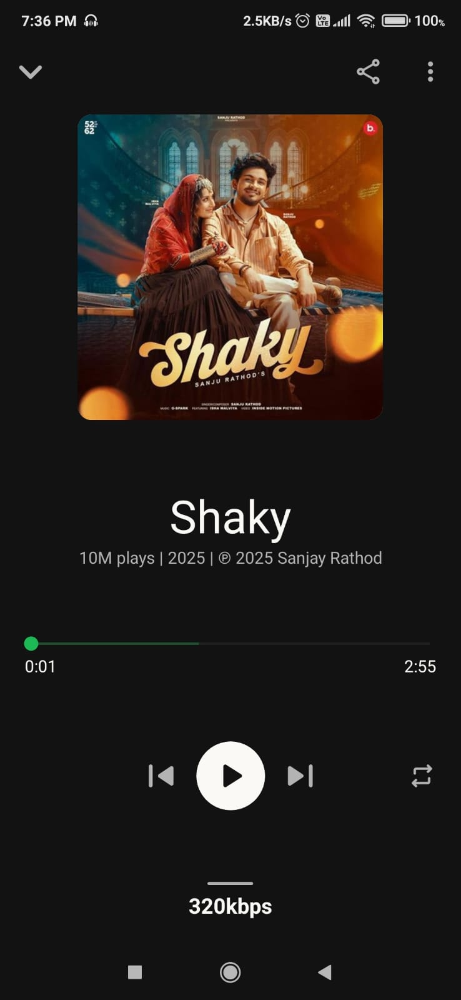
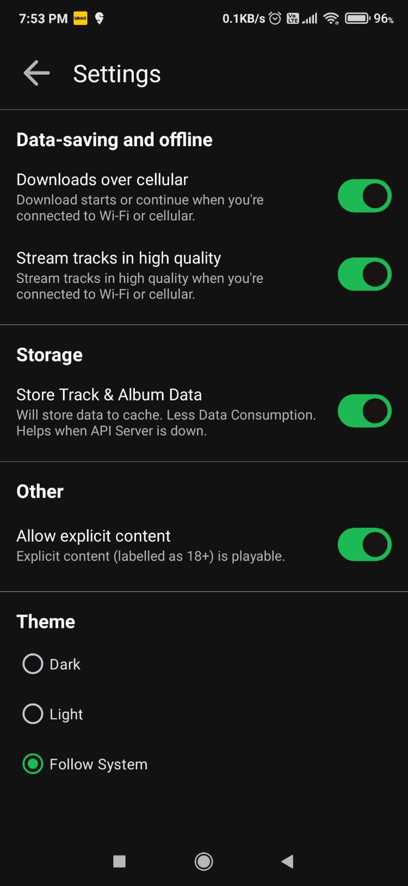
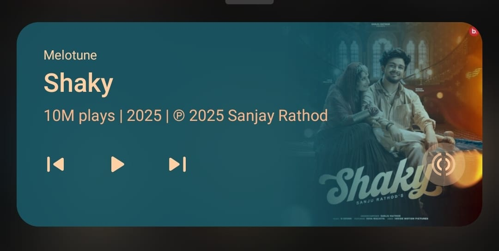
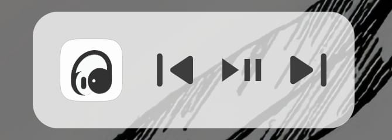
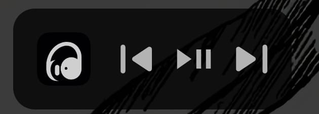

# SaavnMp3 / Melotune

A clean, ad-free Android music streaming app powered by the unofficial JioSaavn API. Inspired by Spotify’s minimal interface, this app enables users to search, stream, and enjoy music seamlessly — all without login or tracking.

<p align="center">
  
  
  
  <br>
  <a href="https://github.com/Harshshah6/SaavnMp3-Android/releases/latest">
    
  </a>
  <a href="https://www.paypal.me/HarshShah06">
    
  </a>
</p>

## Features

- **Ad-Free Experience**: Enjoy music without interruptions.
- **Background Playback**: Keep the music going while using other apps.
- **Up-to-Date Music Library**: Access the latest tracks as they are released.
- **Comprehensive Search**: Find music by track, artist, album, or playlist.
- **Privacy-Focused**: No user data is collected or tracked.
- **Modern UI**: A clean and intuitive interface inspired by Spotify.
- **Auto-Updating Version**: The app version is always displayed and up-to-date.
- **Seamless Playback**: Auto-plays the next song in the queue.
- **Flexible Network Support**: Supports both HTTP and HTTPS for music streaming.
- **Robust Error Handling**: Gracefully handles network and other errors.
- **And much more...**

## Screenshots

<p align="center">
  
  
  
  
  
  
  <br>
  
  <br>
  
  
  <br>
  
  
</p>

## Getting Started

Follow these instructions to get a copy of the project up and running on your local machine for development and testing.

### Prerequisites

* Android Studio (latest version recommended)
* Java 17+
* An Android device or emulator

### Installation

1. Clone the repository:
    ```bash
    git clone https://github.com/harshshah6/SaavnMp3-Android.git
    ```
2. Open the project in Android Studio. 
3. Build and run the app on your device or emulator.

## Built With

*   [Java 17](https://openjdk.org/projects/jdk/17/) - The programming language used.
*   [Saavn.dev](https://github.com/sumitkolhe/jiosaavn-api) - The unofficial JioSaavn API.
*   [Glide](https://github.com/bumptech/glide) - An image loading and caching library.
*   [Picasso](https://github.com/square/picasso) - A powerful image downloading and caching library.
*   [Gson](https://github.com/google/gson) - A Java library to convert Java Objects into their JSON representation.
*   [OkHttp](https://github.com/square/okhttp) - An HTTP client for Android and Java applications.
*   [SwipeRefreshLayout](https://developer.android.com/jetpack/androidx/releases/swiperefreshlayout) - Provides a "pull-to-refresh" gesture.
*   [Shimmer](https://github.com/facebookarchive/shimmer-android) - An Android library that provides an easy way to add a shimmer effect to any view.
*   [Overscroll-decor](https://github.com/EverythingMe/overscroll-decor) - An Android library for an iOS-like over-scrolling effect.
*   [SSP](https://github.com/intuit/ssp) & [SDP](https://github.com/intuit/sdp) - Libraries for responsive UI dimensions.
*   [JAudioTagger](https://github.com/RouHim/jaudiotagger) - A Java library for reading and writing audio metadata.

## Contributing

If you'd like to contribute to Melotune (SaavnMp3-Android),

see the [CONTRIBUTION GUIDE](CONTRIBUTING.md) file for details.

## License

This project is licensed under the MIT License - see the [LICENSE](LICENSE) file for details.

## Acknowledgements

- Inspired by the clean and minimal UI of Spotify.
- A big thanks to [Saavn.dev](https://github.com/sumitkolhe/jiosaavn-api) for the unofficial JioSaavn API.

## Contributors ✨

Thanks to these wonderful people for their contributions:

<a href="https://github.com/Harshshah6/SaavnMp3-Android/graphs/contributors">
  
</a>

Contributions of any kind are welcome!
